# 程序设计A-LAB0

> LAB0目标：
>
> 1. 了解本门课程内容以及课程常用工具
> 2. 环境搭建以及运行第一个C程序
> 3. 其它编程工具及资源介绍（FTP，IDE，浏览器，网站等等）
> 

## 1.课程及本课程教学工具介绍

### 教学团队

##### 教师：陈荣华

联系方式：[chenrh@fudan.edu.cn](http://chenrh@fudan.edu.cn/)

##### 助教：

- 罗宇琦 18307130255@fudan.edu.cn susu518518-
- 段欣然 18307130295@fudan.edu.cn FluffyAnemone
- 黄蕙茹 17302010080@fudan.edu.cn hhr1035048971

### 课程微信群


**注意**：加入课程群请备注 **姓名+学号+专业**，未实名的账户将在一周后被清理。课程群主要用于课程通知、课程讨论等与课程相关的事物，**切勿用于其他用途**。

### 课程安排
软件工程，大一必修专业课
周五 6-8 课堂上课
周四 8-9 为实践课，每周基本上会有一个lab，期中期末会有一个PJ需要提交

### Lab课堂要求与建议  

1. 遇到问题请先自我思考。其次，考虑使用Google/Bing/Baidu（~~可能有些问题你问助教助教也是Google/Bing/Baidu~~）最后，再询问周围的同学和助教。  
2. 在完成Lab后，可以和周围的同学进行语言上的交流和代码上的交流(Code Review)，积极地参与讨论。我们鼓励大家利用互联网资源进行学习，提倡同学间进行沟通交流。但是课程作业和PJ中严禁抄袭，一旦发现抄袭将会判定0分！！！ （一旦确认真的会给  
3. 按时、按说明递交作业，如有情况请及时向TA通过邮件说明。  
4. 如果你不是大牛，请亲自来Lab课并当堂完成。当你抄了一个lab，会根本停不下来，起码学长学姐的历史上经常是这样的。程序设计有五学分，而且是编程生涯的启蒙课程，请大家务必认真对待，真的也不难！是最最简单的几门专业课之一。

### 获取及提交lab

**获取**：通过 `https://github.com/fdu-21ss-programming/labX`，获取（建议通过Download ZIP方式下载）。
		    本次文档在 `https://github.com/fdu-21ss-programming/lab0` 下载

**提交物**：按照具体实践要求完成并压缩。
		    **本次要求将配置环境的过程、运行环境的测试结果、第一个C程序的运行结果截图并整理（格式为word或者pdf，页数不超过5页）。文档中也可以记录LAB遇到的问题或者对课程的想法。**

**提交**：将提交物文档命名为学号\_姓名 （如20302010000\_王明），提交至超星学习通对应的作业中。

**截止时间**：每次需在规定时间内完成，超过时间提交按比例扣分
		    本次作业提交截止时间为：**北京时间 2021年9月19日 23:59:59**

### 课程教学工具介绍
#### GitHub平台

[github](https://github.com/ )是程序员必须知道了解的重要合作平台，我们主要用它进行协作编程与代码托管，我们可以将自己的代码托管到平台中，这样就不用担心自己本地代码的丢失、污染，除此以外，这还是一个交流社区，其社交化编码的理念伴随着开源运动改变着整个开发社区的生态，无数优质项目依托GitHub在全球开源开发者的参与下蓬勃发展，在这里，你可以轻松的找到实现各种功能的代码。当你为了实现一个功能冥思苦想良久而不得后，不妨来这里找找灵感。大家可以进入该网站并完成账号的注册。（<a href="https://blog.csdn.net/qq_41782425/article/details/85183250" target="_blank">点击查看GitHub使用教程</a>）

**再次强调：我们鼓励大家利用互联网资源进行学习，提倡同学间进行沟通交流。但是课程作业和PJ中严禁抄袭，一旦发现抄袭将会判定0分！！！ **

在本学期我们可能用不到GitHub什么功能，但是在之后比如web课程的教学中大家就会对GitHub有更多的了解和使用。


#### 学习通

超星学习通是本课程的重要教学辅助工具。它可以用作课程学习、课堂互动、作业发布与收取、资源共享等。下面将对学习通APP进行简单的介绍。

##### 登录

1、登录选项处选择其他登录方式：


2、在机构栏输入并选中复旦大学：


3、选中复旦大学后会弹出复旦大学统一身份认证页面，输入用户名和密码登录：


这样就通过使用复旦的认证平台登录了学习通（为了方便下一次登录，可以完善账户信息，绑定手机号以方便通过手机号登录）。

##### 加入课程

1、在APP首页的右上角存在“邀请码”，点击邀请码后通过输入邀请码方式加入课程：


2、这里输入程序设计课程的邀请码-`24395745`，以加入课程：


3、也可以直接用“邀请码”-“扫一扫”扫描下方二维码


##### 其他功能

1、加入课程后点击该课程可以进入课程内容页面：


学习通中会在此处通知主题讨论的发布，课堂选人等。

2、点击“作业/考试”可以查看作业完成情况：


3、点击“章节”可以查看课程章节资源（主要是视频教学资源）：


#### 头歌实践教学平台

助教每周会在头歌实践教学平台上设置与学习进度相匹配的编程练习题，同学们可以在网站内编写代码，并在线查看自己的代码是否能正确运行、产生正确的结果，而不必使用自己电脑上的编程环境。下面将对头歌平台进行简单的介绍。

1、在浏览器输入网址（下一次lab课时给出），进入练习界面，类似下图所示：


2、选择某个练习，点击“开始实战”，进入在线编程界面。编写好代码后，点击页面右下方“评测”，即可查看代码运行结果：

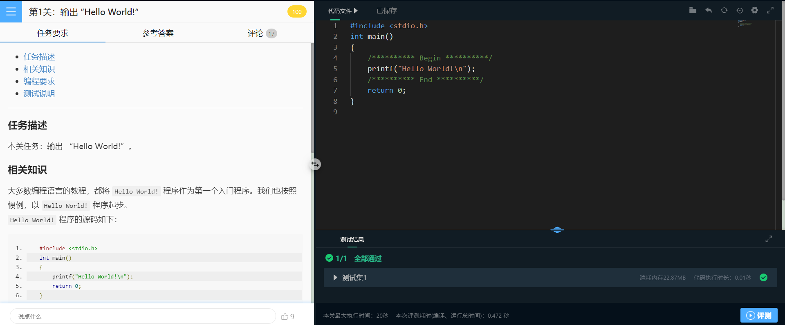


### 其它课程涉及工具

1. 学邮 mail.fudan.edu.cn

   校园中相对严肃、重要的事务大多是通过邮箱进行通知的，这其中包括课程信息、社团信息、留学信息等。除此以外，它也将是同学与导师之间沟通的重要途径。希望大家能够养成定时查看学邮的习惯，重要信息一旦错过可能会比较麻烦。

   因为邮箱大小有限，大家也可以选择使用其它邮箱服务器代收学邮邮件，这样你的学邮一旦收到了信件，比如这里是QQ邮箱代收教程<a href="https://github.com/little-pikachu/documents/blob/master/collect_fudan_mail.md" target="_blank">点击查看设置教程</a>

2. 校园WiFi

   * 校园网：
     fduwireless 会有跳出来的网页，需要登录
     fduwireless.1x 设置好账号和密码后一般不需要重复设置，推荐使用。账号为学号，密码为URP密码（或者邮箱密码）
     iFudan.1x 同上

   * eduroam 世界统一教育网，账号为复旦学邮，密码为URP密码（或者邮箱密码）

3. 学校正版软件

   复旦大学花高价买了很多正版软件造福学生，请参考以下链接：
   http://www.ecampus.fudan.edu.cn/2442/list.htm

   http://baishitong.fudan.edu.cn/wiki/正版软件

   请注意根据指示下载，部分软件可能只能在校园网环境下使用 

4. [Easy Connect](http://www.ecampus.fudan.edu.cn/sxfsyzn/list.htm)  

   想在寝室或者家里连接校园网，也是有办法滴！（PS：但是lab课还是要来的）下载Easy Connect软件，输入URP信息，连接后，相当于你处于校园网环境中。

## 2.环境准备

### 为什么需要编码环境

课程学习的编程语言为C语言。C语言是一种高级语言，由高级语言编写的程序为源代码。计算机不能直接运行源代码，必须将源代码翻译为机器可执行的机器代码后计算机才能运行程序。从上述过程可知，完成编程过程需要两个重要工具：代码开发环境以及编译器。

代码开发环境是开发者的工作平台，开发者直接在代码编辑器中编写代码完成特定的程序。除了编辑功能，代码开发环境一般也包括了代码补全、代码静态检查等功能。

编译器将高级语言编写的源程序翻译为机器可执行的格式。主流的C语言编译器包括GCC以及Clang。GCC是最通用的编译器，对标准支持比较好，所以一般推荐GCC编译器。

除了以上两者，调试器也是编码中常用到的工具。调试器让程序在希望的地方停下，此时支持查看变量、寄存器、内存及堆栈。更进一步能够修改变量及内存值。GDB是主流的C、C++调试器，功能强大，特别方便开发者调试程序寻找bug。

不同的操作系统对软件的支持程度不一样，所以配置各种操作系统的过程有所差异。主流的操作系统为Windows，MAC OS，Linux。个人电脑主要为Windows以及MAC OS，所以我们将分别介绍Windows和MAC OS配置环境的过程。

### Windows环境配置过程（MAC用户可忽略）

#### Step 1：MinGW包管理工具

MinGW(Minimalist GNU For Windows)是个精简的Windows平台C/C++编译器。MinGW提供了一个完整的开源编程工具集，方便开发者进行C/C++运行库的管理。通过MinGW我们能够很快安装GCC以及GDB等编码环境。

##### 下载MinGW

[点击这里开始下载MinGW](https://osdn.net/projects/mingw/downloads/68260/mingw-get-setup.exe)

点击链接后，浏览器将会自动下载MinGW，等待下载完成即可。

>超星课程中我们已经准备了相应的文件，同学们可以直接在课程资源中找到本次lab的所有安装包。具体路径为：超星主页->C语言程序设计->资料->C编译环境。

##### 安装MinGW

> 注意：安装时请保证网络能够正常使用。

打开下载好的`mingw-get-setup.exe`安装程序，按照默认选项进行安装。

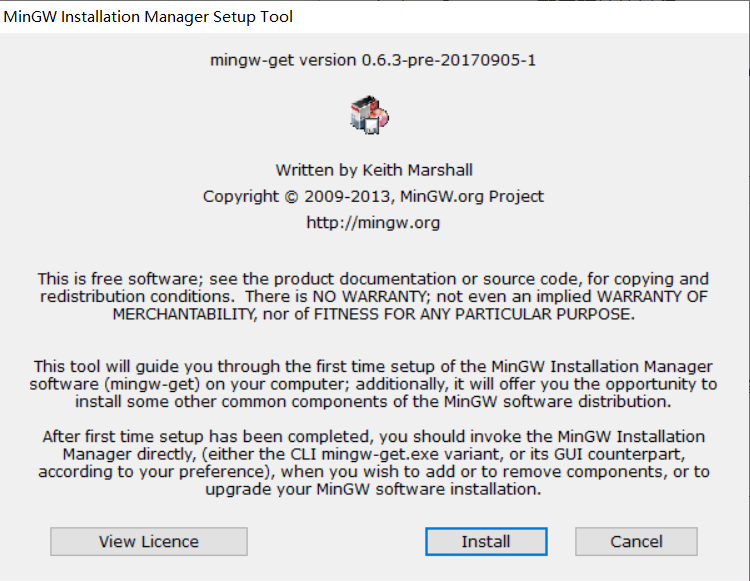

安装路径默认在C盘，我们也可以自定义安装位置。

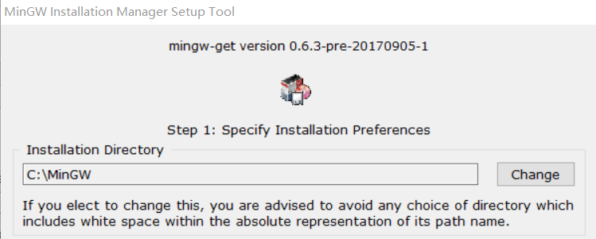

> 注意：安装的位置将会在后面使用到，所以请务必记住安装的路径。

MinGW安装结束后，我们将会看到MinGW的包管理页面。


#### Step 2：GCC编译器以及GDB调试器

##### 准备GCC编译器

在MinGW包管理页面中，找到`mingw32-gcc-g++-bin`,点击选择`Mark for Installation`。

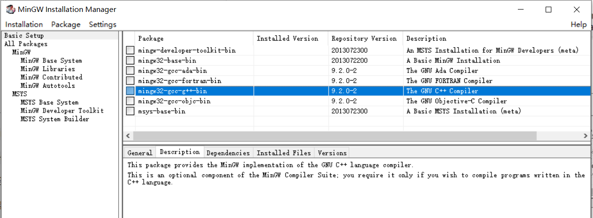

##### 准备GDB调试器

点击MinGW包管理工具左侧`All Packages`，再点击`MinGW Base System`。在右侧列表中寻找`mingw32-gdb-bin`，点击选择`Mark for Installation`。

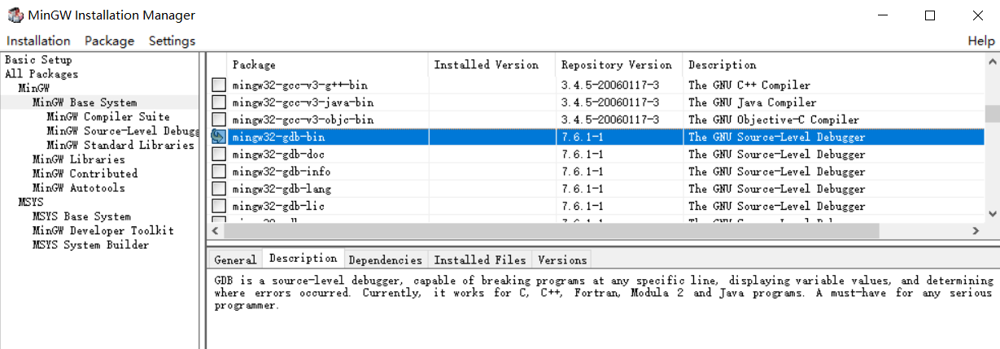

##### 开始下载相关软件

点击左上角的 `Installation` 菜单中的 `Apply changes` 选项，然后管理器将开始在线安装或更新被选中的组件。

安装完成后关闭包管理器，如果由于某种原因安装未能成功，在退出程序前程序将给予提示，选择 `review changes` 选项重新安装即可。

> 这一步如果出现GDB无法安装的问题，请去掉第二步的GDB选项，先下载GCC编译器。之后从超星资源中下载gdb-7.6.1-1-mingw32-bin.tar.lzma文件，解压后放入MinGW/bin文件夹中。

#### Step3：配置环境变量

> 环境变量是指操作系统运行环境的参数，一般是文件夹路径。当我们输入gcc命令时，我们希望操作系统在我们指定的位置上寻找gcc文件。

打开 控制面板 -> 系统和安全 -> 系统 -> 高级系统设置 -> 环境变量。

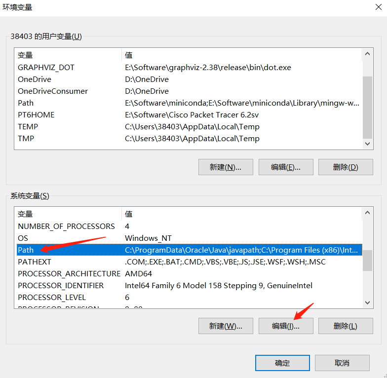

在`系统变量`中寻找`Path`，点击编辑。

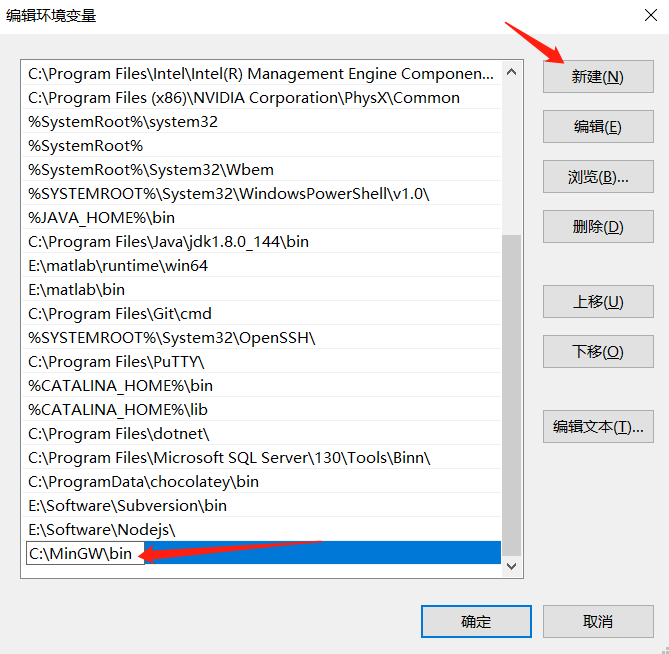

点击`新建`，在尾部插入MinGW安装的路径，点击确认。

> 注意，这里使用默认路径，如果你修改了MinGW的安装路径，请使用**你自己配置的MinGW安装路径下的bin文件位置**。

#### Step4：测试环境

之前的工作完成后，我们测试一下已经配置好的环境。

##### 打开命令行终端

键盘输入`win+r`，打开的页面中输入cmd，点击确定。

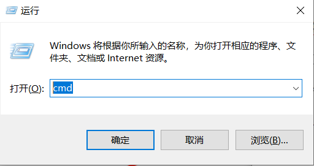

完成后，将打开命令行终端。

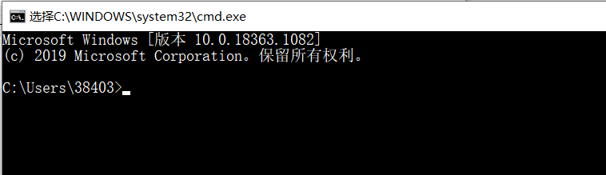

##### 测试GCC与GDB

在终端中输入`gcc -v`查看GCC的版本信息，输入`gdb -v`查看gdb版本。

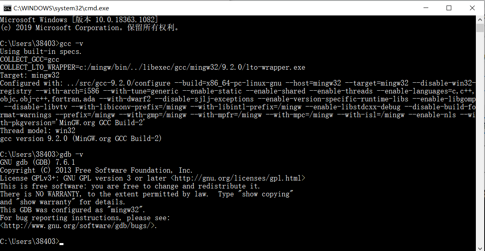

如果出现以上结果，则说明安装成功。如果出现gcc命令不存在的提示说明过程有误，建议检查环境变量的路径是否正确。

#### Step5：集成开发环境Code::Blocks

> Code::Blocks是轻量级的C/C++的集成开发环境。本课程主要以Code::Blocks为例讲解代码，希望大家都能准备Code::Blocks开发环境。

##### 下载Code::Blocks

[点击这里下载Code::Blocks](http://sourceforge.net/projects/codeblocks/files/Binaries/20.03/Windows/codeblocks-20.03-setup.exe)

点击链接，下载Code::Blocks安装包。Code::Blocks安装包相对比较大，下载时请耐心等待。

##### 安装Code::Blocks

打开安装包`codeblocks-20.03-setup.exe`，按照提示，使用默认配置即可。

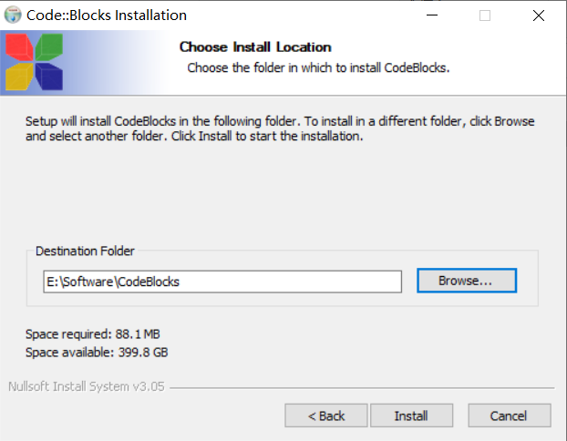

Code::Blocks安装位置可以根据自身情况自由选择。

##### Code::Blocks配置

> Code::Blocks是代码开发平台，我们需要为其指定gcc编译器以及gdb调试器。

安装完成后，打开Code::Blocks。

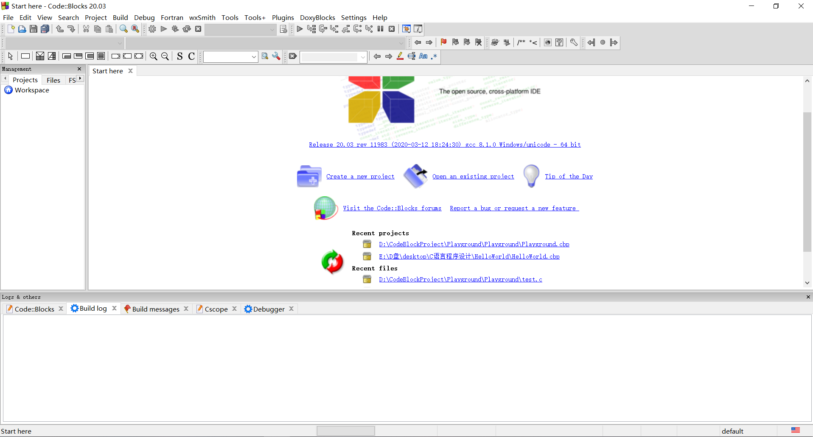

打开 `Settings`->`Compiler`->`Global compiler settings`->`Toolchain executables`。修改`Compiler's installation directory` 为MinGW/bin的路径。

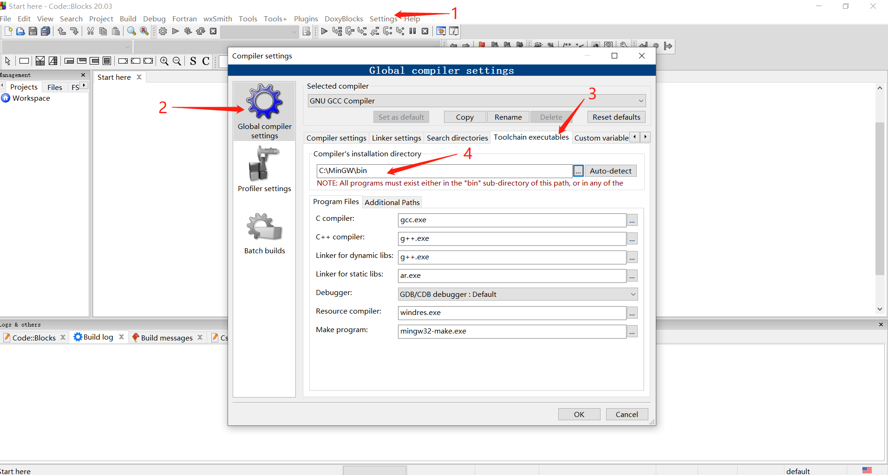

打开`Settings` -> `Default`，修改`executable path`为MinGW/bin/gdb.exe的路径。

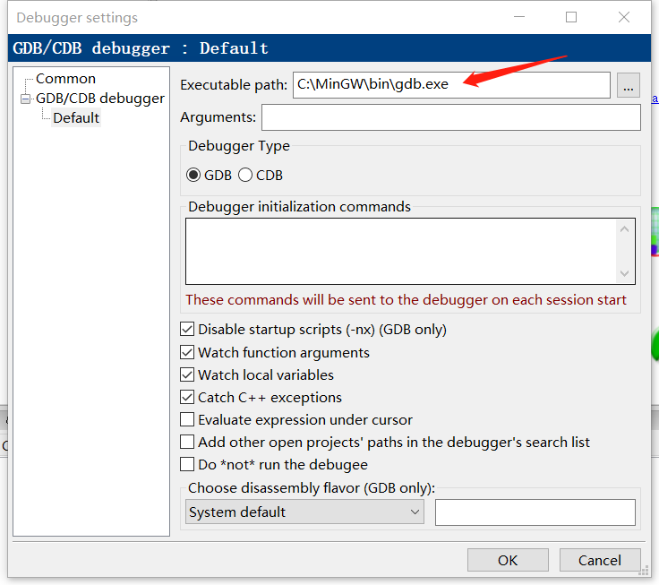

至此，Code::Blocks开发环境准备完毕，同学们可以根据课程内容尝试在Code::Blocks上运行程序。

### MAC OS配置环境过程（Windows用户可忽略）

#### Step 1: 打开终端

`command + 空格` 打开聚焦搜索，在搜索框中输入 `terminal`，点击下方 “终端” 或直接回车，即可打开终端

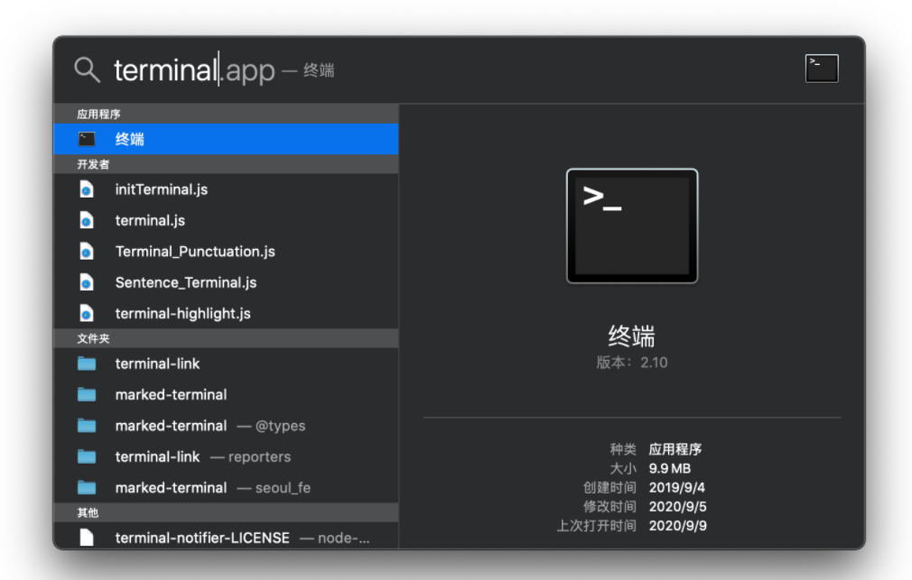

#### Step 2: 检测GCC编译器

在终端中输入：

```
$ gcc -v
```

若终端返回以下内容，则说明你已经安装好 `gcc` 了，若没有返回类似内容，你需要在 `App Store` 内下载 `Xcode` 软件，再重新打开终端尝试。

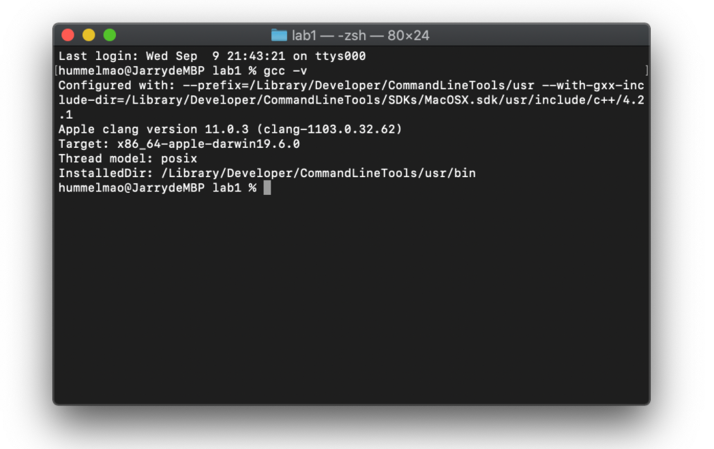

#### Step 3: 安装Code::Blocks或者Clion

MAC OS安装Code::Blocks相对比较繁琐，具体参考[链接](https://www.dummies.com/programming/cpp/how-to-install-c-codeblocks-in-macintosh/)。

编程工具是次要的，在MAC OS上我们更加推荐Clion，具体安装过程请点击[这里](https://www.cnblogs.com/little-cat/p/clion-anzhuangpeizhi.html)。

> Clion是商业软件，学生可以[进行学生身份认证](https://www.jianshu.com/p/2c6977ab00b1)获取一年的免费使用权限。


## 运行第一个C程序

Hello World是著名的贝尔实验室提出的范式了，学任意编程语言，Hello World都是起始代码。在集成编译环境中，很多必要的工作被IDE（集成开发环境）隐藏，所以第一次LAB我们希望大家先学习最经典的程序运行方式。这里我们将学习如何在命令行中编译运行helloworld.c。

### Step 1: 编写代码

在桌面新建文件helloworld.c，将以下代码复制至文件中，保存文件。

```
#include <stdio.h>

int main(){
	printf("Hello World/n");
	return 0;
}
```

> 这里只需要用简单的文本编辑器编辑文件即可。Windows可以使用记事本，MAC OS可以使用文本编辑器。
>
> helloworld.c文件的位置可以自由选择。

### Step 2: 进入文件所在位置

使用配置环境中提到的方法打开命令行终端，输入以下命令：

```
# Windows用户
$ cd desktop
# MAC OS用户
$ cd ~/desktop
```

因为我们创建的文件在桌面上，所以我们能够在当前位置找到`helloworld.c`。

>cd是命令行中常用命令，用于切换工作目录。这里我们使用cd命令寻找helloworld.c的父目录。

### Step 3: 编译运行helloworld.c

在`helloworld.c`所在文件夹中输入以下命令编译程序：

```
$ gcc helloworld.c -o helloworld.exe
```

编译成功后将在桌面产生`helloworld.exe`可执行文件，然后输入以下命令运行我们编译输出的文件:

```
# windows用户
$ .\helloworld.exe
# MAC OS用户
$ ./helloworld.exe
```

看看能否输出`Hello World`？

如果成功输出`Hello World`，那么恭喜，编程生涯正式开启！

## 3.其它编程工具及资源介绍

### FTP介绍

~~已经是时代的眼泪~~

FTP 站点类似于云盘，在FTP上可以下载软件学院的课程资料

进入FTP之前**必须连上学校内网**

源地址：`ftp://10.12.5.33`

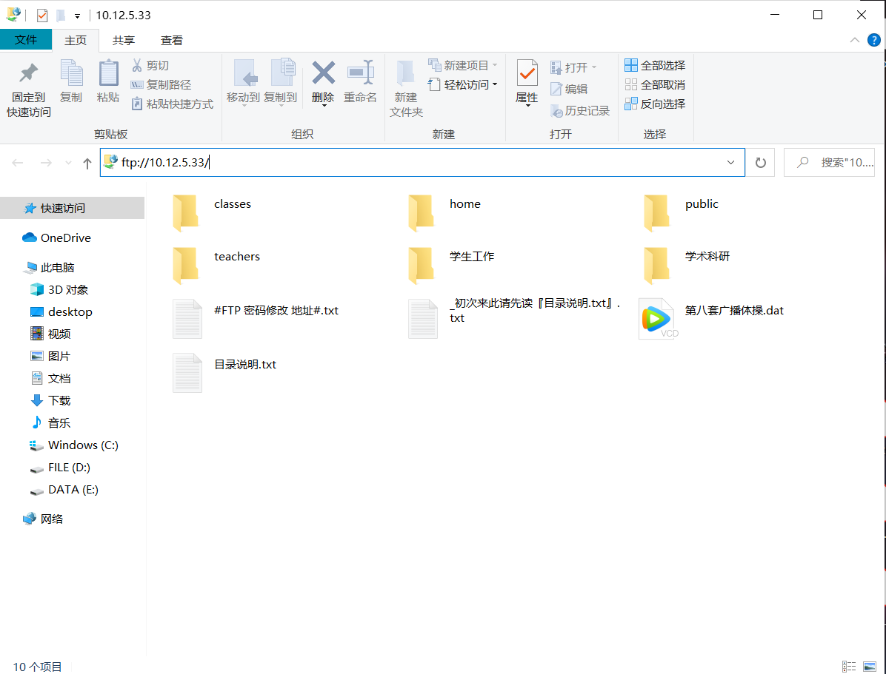

1. 使用ftp客户端或者Windows资源管理器，在学校内网下访问，用户名与密码都是学号，登入之后请改密码。
2. 还有一个无门槛的账户（用户名 `ss` 密码 `ss`），提供紧急使用。
3. Mac端推荐使用fileZilla作为客户端，地址在学院文件夹里。

### 其他编程工具

- #### 集成开发环境(IDE)

  集成开发环境（Intergreated Development Environment）是辅助程序员开发的应用软件的一个总称

  在实际开发中，除了运行程序必须的工具外，我们往往还需要很多其他辅助软件，例如语言编辑器、自动建立工具、除错器等等。这些工具通常被打包在一起，统一发布和安装，例如 Clion、code::blocks等，它们统称为集成开发环境（IDE）

  1. Visual Studio (for Windows)
  2. Xcode (for Mac)

- #### 轻量级文本编辑器

  1. Visual Studio Code (强力推荐)
  2. Atom
  3. Sublime Text

### 其他学习工具

- #### 浏览器

  [Google Chrome](https://www.google.cn/chrome/)

  [Mozilla Firefox](http://www.firefox.com.cn/)

- #### 常用网站

  [CSDN](https://blog.csdn.net/)

  [Stack Overflow](https://stackoverflow.com/)

  

